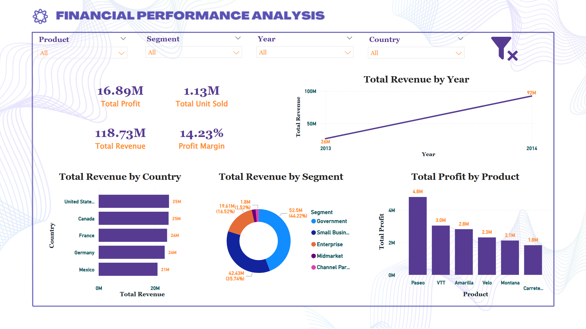

# Financial Performance Analysis | Power BI Dashboard

## Overview
Comprehensive financial analytics dashboard tracking revenue, profit, 
and segment performance with interactive slicers.

## Dashboard Preview

## Key Metrics
- Total Revenue: $118.73M
- Total Profit: $16.89M
- Profit Margin: 14.23%
- Units Sold: 1.13M
- Revenue Growth: $26M (2013) → $92M (2014) — 254% YoY increase

## Key Insights
- Government segment drove 44.22% of total revenue
- Small Business contributed 35.74% of revenue
- USA and Canada each contributed $25M in revenue
- Paseo was the top-performing product at $4.8M profit
- Built dynamic 4-filter slicer panel (Product, Segment, Year, Country)

## Tools Used
- Microsoft Power BI
- DAX
- Power Query
- Financial Analysis
- KPI Reporting
